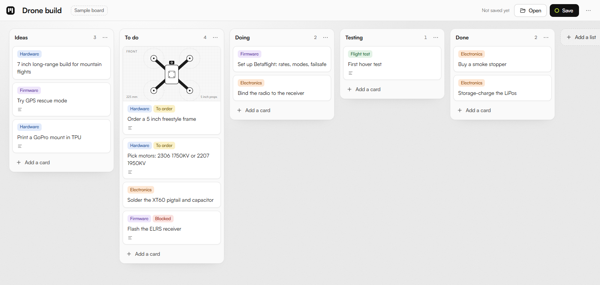

# TrelloClone

**Live board: https://jjkramhoeft.github.io/TrelloClone/**

[](https://jjkramhoeft.github.io/TrelloClone/)

A simple, single-user Trello clone. The whole board loads from and saves to a JSON file on your own machine. There are no accounts, no server and no sync: one person, one file. To share a board, share the file.

## What it does

- Lists and cards with drag and drop (mouse and touch; press and hold on a phone).
- Cards have a title, a description, coloured labels and an optional image.
- **Open** (Ctrl+O) loads a board JSON file. You can also drop a `.json` file onto the page.
- **Save** (Ctrl+S) writes the board back to the same file. The ring on the Save button is filled when the file matches the board and hollow when there are unsaved changes.
- Trello JSON exports open directly, so you can bring an existing board over. In Trello, use Menu → Print, export and share → Export as JSON. Archived lists and cards are skipped. Images uploaded to Trello are not imported, because Trello only serves them to logged-in users.
- Images are embedded in the JSON, so one file holds the whole board. Large photos are scaled to 1600px first.
- The browser keeps a backup of the current board, so a refresh doesn't lose work. Deleting a card, list or label offers an Undo.

## Browser support

Chrome and Edge save straight back to the file you opened. Firefox and Safari can't write files from a web page, so there Save downloads the JSON instead.

## Running it locally

It is one self-contained `index.html` with no build step and no dependencies. Download it and open it in a browser, or serve the folder:

```bash
python -m http.server 5178
```

## File format

```json
{
  "format": "planning-board",
  "version": 1,
  "savedAt": "2026-10-03T09:00:00.000Z",
  "board": {
    "title": "Drone build",
    "labels": [{ "id": "a1", "name": "Hardware", "color": "blue" }],
    "lists": [
      {
        "id": "l1",
        "title": "To do",
        "cards": [
          {
            "id": "c1",
            "title": "Order a 5 inch freestyle frame",
            "description": "225 mm wheelbase",
            "labels": ["a1"],
            "image": null
          }
        ]
      }
    ]
  }
}
```

Label colours use Trello's names: `green`, `yellow`, `orange`, `red`, `purple`, `blue`, `sky`, `lime`, `pink`, `black`. `image` is a data URL, an `https://` link, or `null`.

## Notes

- [PRODUCT.md](PRODUCT.md) and [DESIGN.md](DESIGN.md) describe the product and the design system.
- The Satoshi typeface by Indian Type Foundry is embedded in `index.html` under the ITF Free Font License ([fontshare.com](https://www.fontshare.com/fonts/satoshi)).
